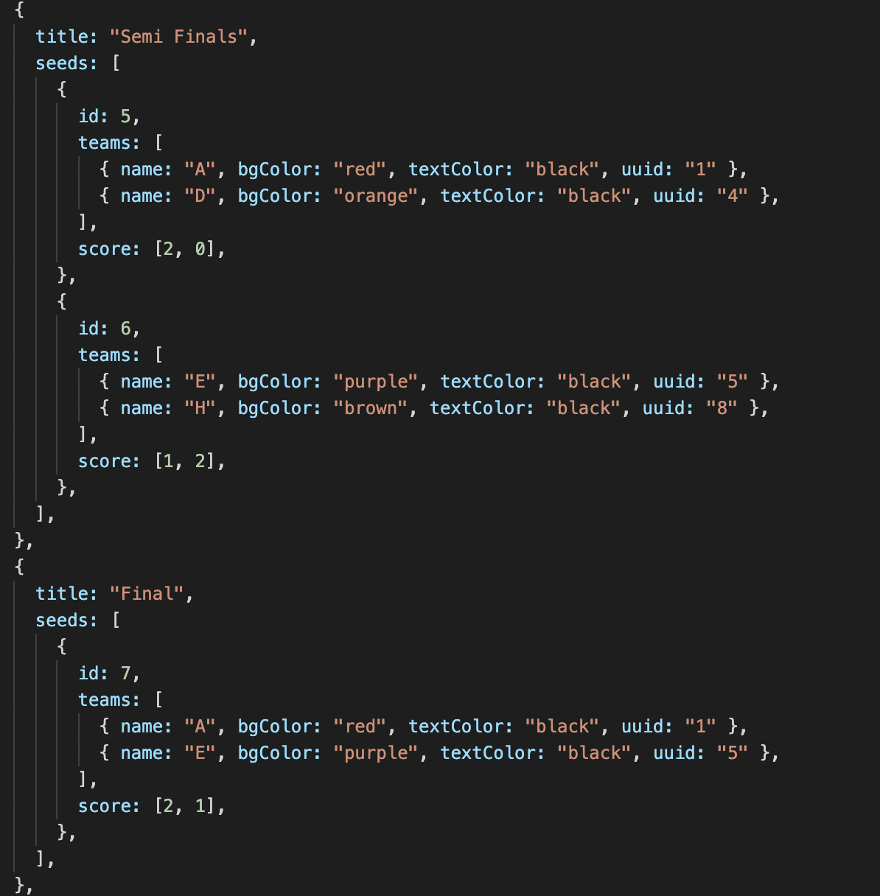

# Rock-Paper-Scissors-Back-End

        

**RPS Tournament is a social website that allows people to play a rock paper scissors tournament against their friends.**

# Table of contents

 
 - [Usage](#usage)
   - [Locally](#locally)
   - [Deployed](#deployed)
 - [Tournament data structure](#tournament-data-structure)
   - [Sockets Map](#sockets-map)
   - [Tournaments Map](#tournaments-map)
   - [Games Map](#games-map)
   - [Tournament Info Map](#tournament-info-map)
   - [User Data Map](#user-data-map)
   - [Chat Map](#chat-map)

## Usage
This backend needs to be used in conjunction with the [RPS frontend](https://github.com/elksy/Rock-Paper-Scissors-Front-End)


We have development and production environment files that will determine what port the server is run on and what origin the CORS will listen to

### Locally
To run the server you will need to enter this command on the terminal:

```
deno run --allow-net --allow-read --allow-env --unstable server.js
```

By default the server will run on the development environment file due to this line in the server.

```
const DENO_ENV = (await Deno.env.get("DENO_ENV")) ?? "development";

```
Which runs the server on port 8080 and listens to the origin localhost:3000

### Deployed

To run the server deployed you will need to enter this command on the terminal:

```
DENO_ENV=production deno run --allow-net --allow-read --allow-env --unstable server.js
```
This will choose the environment file that the server will use, which will run the environment file on port 80 and listen to the origin [rock-paper-scissors-tournament.netlify.app](https://rock-paper-scissors-tournament.netlify.app/), our frontend website.


## Tournament data structure

The tournament bracket that stores the position and score of all players is structured in the format of react-bracket so that it can be displayed properly using that library




### Sockets Map
Websockets are stored in a map that contains all the tournament IDs that are assigned to another map containing all the user websockets defined by their UUID.

```
let sockets = new Map();
// {
//    tournamentID: Map {
//      uuid: socket,
//      uuid: socket,
//      uuid: socket
//   }
// }
```


### Tournaments Map
Tournament brackets are stored in a map with the tournament id as the key.

```
let tournaments = new Map();
// {
//    tournamentID: [tournament bracket data],
//    tournamentID: [tournament bracket data]
// }
```


### Games Map
Games bracket is a map that stores all the tournament IDs that are assigned to another map that stores players in each match using the bracket seed as the key.

```
let games = new Map();
// {
//    tournamentId :  
//    seed id: Map {
//       uuid: socket,
//       uuid: socket
//   }
// }
```


### Tournament Info Map
The tournament information is stored as a map with all the configurations for a tournament with the tournament ID as the key.

```
let tournamentInfo = new Map();
//  { 
//    tournamentId : {
//       rounds: rounds,
//       timeLimit: timeLimit,
//       type: type
//     }
// }
```

### User Data Map
The user’s data is stored in a map that contains all the tournament IDs assigned to another map that contains all the user’s information required to make decisions and display them on the bracket.

```
let userData = new Map();
// {
//   tournamentID: Map {
//     uuid: {
//       name: 'rob',
//       bgColour: 'green',
//       textColor: 'black,'
//       uuid: uuid
//     }
//   }
// }
```

### Chat Map
A map is made for the chat that contains all the tournaments, which is assigned to another map that stores all the sockets for players in that tournament to send and receive chat messages.

```
let chat = new Map();
// {
//   tournamentID: Map {
//     uuid: socket,
//     uuid: socket,
//     uuid: socket,
//   }
// }
```

## Developers
The developers that worked on this project are: 

 - Project Manager & Engineer: Mariam Raashid  
 - Architect, Development Operations & Engineer: Rob Elkes  
 - Quality Assurance & Engineer: Kishor Shris  
 - Quality Assurance & Engineer: Harry Davis
